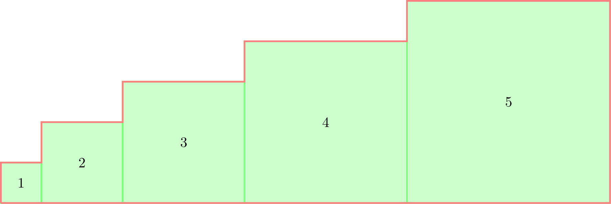

> 小洛有 $n$ 个正方形，第 $1$ 个正方形的边长为 $1$，第 $2$ 个正方形的边长为 $2$，以此类推，第 $n$ 个正方形的边长为 $n$。它们被紧密地排列成一行。小洛想要知道这个图案的周长和面积分别是多少。
>
> 例如当 $n=5$ 时的图案如下图所示。红色的边框代表整个图案的周长，绿色区域代表整个图案的面积：
>
> 
>
> **输入格式**
>
> 输入一个正整数 $n$。
>
> **输出格式**
>
> 输出两行。
>
> 第一行一个正整数代表图案的周长；
>
> 第二行一个正整数代表图案的面积；
>
> **输入样例 1**
>
> ```
> 5
> ```
>
> **输出样例 1**
>
> ```
> 40
> 55
> ```
>
> **输入样例 2**
>
> ```
> 9
> ```
>
> **输出样例 2**
>
> ```
> 108
> 285
> ```
>
> **数据范围**
>
> 对于 $70\%$ 的数据，$1 \leq n \leq 100$；
>
> 对于所有数据，$1 \leq n \leq 100000$。

本题要求计算由 $n$ 个正方形（边长分别为 $1, 2, \dots, n$）紧密排列成一行后所形成的复合图形的**总面积**和**总周长**。

## 面积计算分析

### 推导过程

每个正方形的面积等于边长的平方。由于有 $n$ 个正方形，边长依次为 $1, 2, \dots, n$，因此总面积 $S$ 为前 $n$ 个正方形面积的和：

$$S = 1^2 + 2^2 + 3^2 + \dots + n^2$$

根据平方和公式，前 $n$ 个正方形面积的数学表达式为：

$$S = \frac{n(n+1)(2n+1)}{6}$$

### 数据范围与复杂度

- **数据范围**：$1 \le n \le 100000$。
- **复杂度要求**：如果使用循环累加，时间复杂度为 $O(n)$，在 $n = 100000$ 时完全可以通过。但利用求和公式可以直接在 $O(1)$ 时间内计算出结果。
- **注意点**：当 $n$ 较大时，平方和可能会超出标准 32 位整数（`int`）的范围，因此在编写代码时建议使用 64 位整数（如 C++ 中的 `long long`）来防止溢出。

## 周长计算分析

把所有正方形排成一行时，我们可以从四个方向（上下、左右）来观察图形的周长贡献：

### 上下方向（水平边界）

无论是哪个正方形，其上方和下方各有一条边长为 $i$ 的水平边暴露在外。因此，所有正方形的上方边长总和与下方边长总和相等，均为：

$$\sum_{i=1}^{n} i = \frac{n(n+1)}{2}$$

所以上下两部分贡献的周长为：$2 \times \frac{n(n+1)}{2} = n(n+1)$。

### 左右方向（竖直边界）

- **左右两端的边界**：最左侧有第 $1$ 个正方形的左边界（长为 $1$），最右侧有第 $n$ 个正方形的右边界（长为 $n$），它们的长度和为 $1 + n$。

- **正方形相接处的竖直重叠边**：每相邻两个正方形相接时，会“抵消”一部分竖直方向的边。具体来说，第 $i$ 个正方形和第 $i+1$ 个正方形相接时，重合的竖直边长度为较小正方形的边长，即 $\min(i, i+1) = i$。但在外围轮廓上，由于高度差，会产生一段长度为两正方形边长差的竖直边，即 $\vert{}(i+1) - i\vert{} = 1$。

- 实际上，如果我们观察最右侧的轮廓（或者将所有竖直向右/向左的边界展开），除了左右两端的固定边界外，中间每一个相邻接缝处产生的竖直高度差累加起来，其总和也是一个有规律的等差数列。

- 更直观的理解方式：整个图形的竖直方向轮廓线段投影总长度，其实可以看作是由最右侧那根最高的主边界（长度为 $n$）以及下方阶梯状错位所带来的贡献共同组成。

- 经过严谨推导或找规律，整个图形的总周长公式为：

  $$\text{周长 } C = 2 \times \sum_{i=1}^{n} i + 2n = 2 \cdot \frac{n(n+1)}{2} + 2n = n(n+1) + 2n = n(n+3)$$

  *(注：也可以通过样例来验证：当 $n=5$ 时，$5 \times (5+3) = 40$，与样例输出一致；当 $n=9$ 时，$9 \times (9+3) = 108$，与样例输出一致。)*

## 参考代码

```c++
#include <iostream>
using namespace std;

int main() {
    long long n;
    cin >> n;

    // 直接通过公式计算
    long long perimeter = n * (n + 3);
    long long area = n * (n + 1) * (2 * n + 1) / 6;

    cout << perimeter << endl;
    cout << area << endl;

    return 0;
}
```

