import { Image } from 'astro:assets';
import MaxMinHeapImg from './max-min-heap.png';
import AutualRepresentationImg from './autual-representation.png';

**堆（Heap）** 是计算机科学中一种非常经典且高效的 **基于树状结构** 的特殊数据结构。它在优先队列、排序算法（堆排序）以及图算法（如 Dijkstra 算法）中扮演着极其重要的角色。

## 堆的定义与分类

**堆（Heap）** 是一种基于 **完全二叉树（Complete Binary Tree）** 实现的高效数据结构。

在逻辑结构上，它满足以下两个核心特征：

1. **结构特性（完全二叉树）**：除了最后一层外，其余各层的节点数均达到最大值；而在最后一层，所有节点都尽可能地紧靠在最左侧。
2. **堆属性（Heap Property）**：父节点与子节点之间存在着固定的关系。根据这种顺序关系的不同，堆主要分为以下两类：

   - **大顶堆 / 最大堆 (Max-Heap)**：每个父节点的值都 **大于或等于** 其任意子节点的值。因此，根节点（堆顶）始终包含整个堆中的 **最大值**。常用于堆排序（升序）和求 Top-K 大元素等场景。
   - **小顶堆 / 最小堆 (Min-Heap)**：每个父节点的值都 **小于或等于** 其任意子节点的值。因此，根节点（堆顶）始终包含整个堆中的 **最小值**。常用于实现优先队列、Dijkstra 最短路径算法以及求 Top-K 小元素等场景。

<figure>
  <Image src={MaxMinHeapImg} alt="大顶堆与小顶堆二叉树对比示意图" widths={[400, 800, 1200]} />
  <figcaption>大顶堆（Max‑Heap）与小顶堆（Min‑Heap）对比，大顶堆父节点值大于等于子节点，小顶堆父节点值小于等于子节点</figcaption>
</figure>

```alert
type: warning
style: dash
description: 注意概念区分：请勿将数据结构中的“堆”与操作系统/编程语言内存管理中的“堆（Heap Area）”相混淆。前者是一种存储和组织数据的逻辑结构，后者则是用于动态分配内存的物理区域，两者在概念上毫无关联。
```

## 堆的物理存储

虽然堆在逻辑上是一棵二叉树，但在实际物理内存中，它通常 **直接用数组（Array）存储**，而不需要像普通二叉树那样使用指针。

依靠完全二叉树的性质，节点在数组中的索引（以 0 为起始下标）天然具备如下数学规律：

- 对于索引为 $i$ 的节点：
  - **左子节点** 索引：$2i + 1$
  - **右子节点** 索引：$2i + 2$
  - **父节点** 索引：$\lfloor (i - 1) / 2 \rfloor$

<figure>
  <Image src={AutualRepresentationImg} alt="堆数组层序划分示意图" widths={[400, 800, 1200]} />
  <figcaption>堆的数组层序排布，一维数组按树的层级依次存放节点，下标对应二叉树不同深度</figcaption>
</figure>

```alert
type: success
style: dash
description: 好处：极大地节省了指针带来的空间开销，并且能够利用 CPU 缓存的高效连续读取。
```

## 堆的核心操作

堆的核心在于维护其“性质”。每次插入或删除元素后，都需要进行调整：

### 插入元素 (Push / Insert)

在堆中插入新元素时，需要通过 **向上调整（Sift-Up / Heapify-Up）** 机制来维护堆的结构与属性。

以下以向最大堆（Max-Heap）中插入元素 `7` 为例，展示完整的插入步骤：

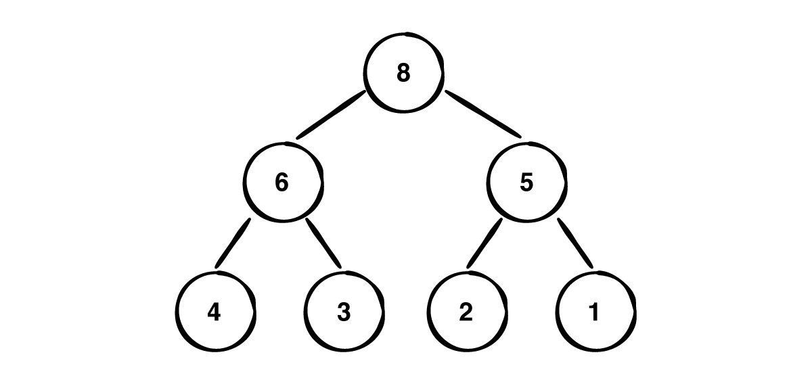

1. **追加至末尾**

   根据完全二叉树的结构要求，将新元素 `7` 添加到堆的最后一个叶子节点位置（即数组末尾）。

   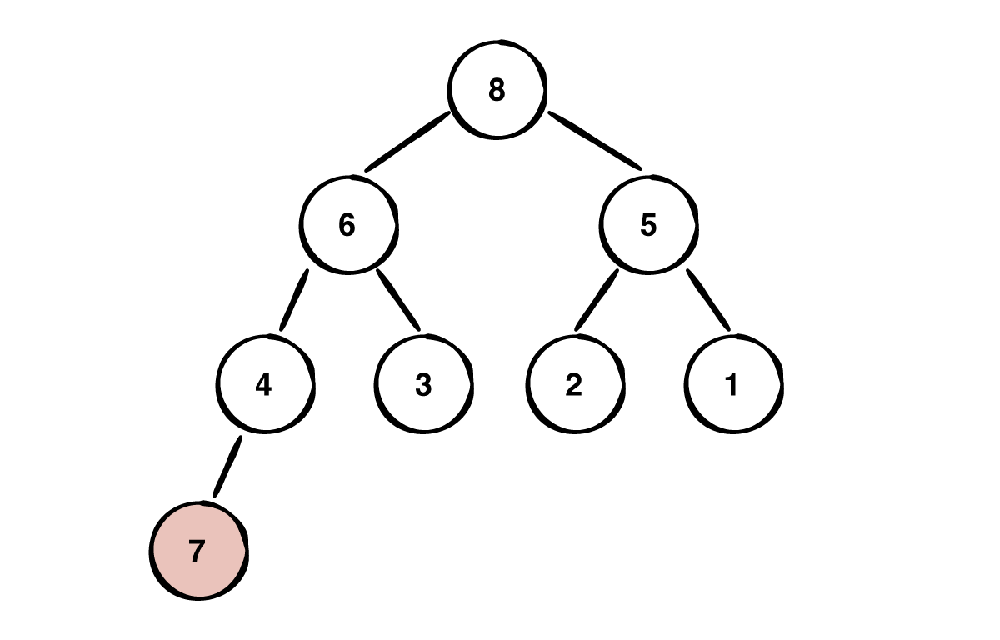

2. **第一次向上调整**

   比较 `7` 与其父节点 `4` 的大小。因 $7 > 4$，打破大顶堆规则，将 `7` 与 `4` 交换位置，`7` 上浮一层。

   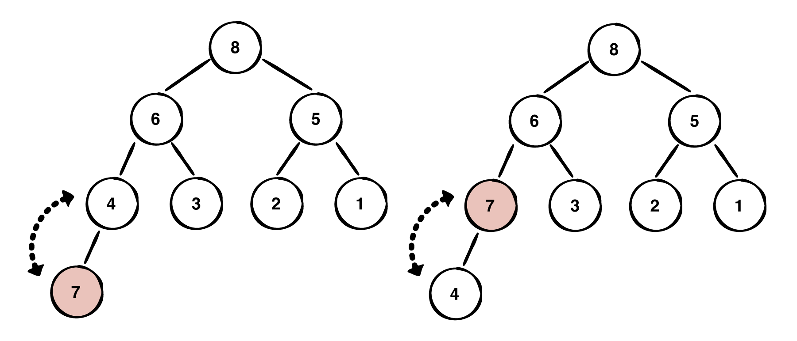

3. **第二次向上调整**

   继续比较 `7` 与其新的父节点 `6` 的大小。因 $7 > 6$，再次将 `7` 与 `6` 交换位置，`7` 继续上浮。

   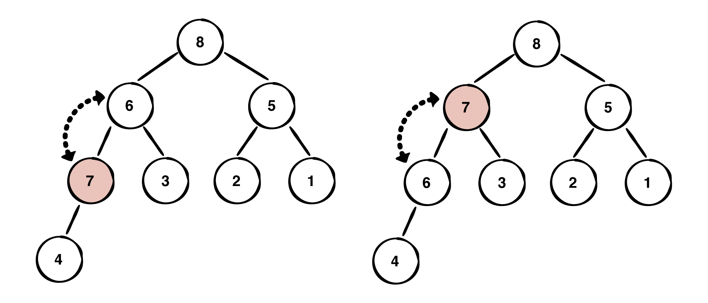

4. **再次比较父节点**

   继续将 `7` 与其新的父节点（根节点 `8`）进行比较。

   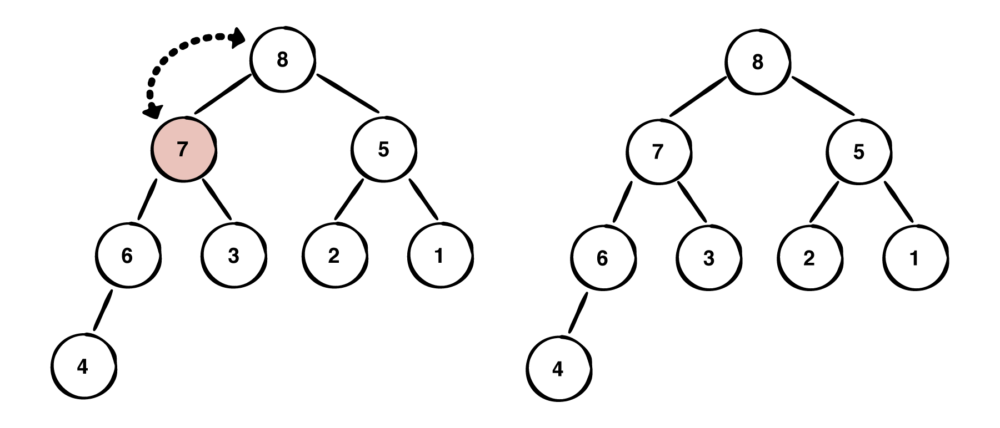

5. **满足规则，完成插入**

   因 $7 < 8$，满足父节点大于等于子节点的堆属性，上浮调整终止，堆重新恢复平衡。

#### 插入的实现

```c++
// 向上调整：不断与父节点比较并交换，直到满足大顶堆性质
void siftUp(int i) {
    while (i > 0) {
        int parent = (i - 1) / 2; // 计算父节点下标

        // 若当前节点大于父节点，说明破坏了堆属性，进行交换
        if (heap[i] > heap[parent]) {
            std::swap(heap[i], heap[parent]);
            i = parent; // 跟踪节点上升到父节点位置，继续向上比较
        } else {
            break; // 已经满足堆属性，提前终止
        }
    }
}

// 插入接口
void push(int val) {
    heap.push_back(val);     // 1. 追加到数组末尾（维持完全二叉树结构）
    siftUp(heap.size() - 1);  // 2. 对新插入的叶子节点执行向上调整
}
```

### 删除堆顶元素 (Pop / Extract-Min or Max)

在堆中，删除操作通常指的是**弹出堆顶元素**（最大值或最小值）。弹出后，需要通过 **向下调整（Sift-Down / Heapify-Down）** 机制来恢复堆的结构与属性。

以下以最大堆（Max-Heap）为例，展示删除堆顶的完整步骤：

1. **交换与切除**

   将堆顶元素 `10` 与末尾叶子节点 `3` 交换位置，随后弹出并移除位于末尾的 `10`。

   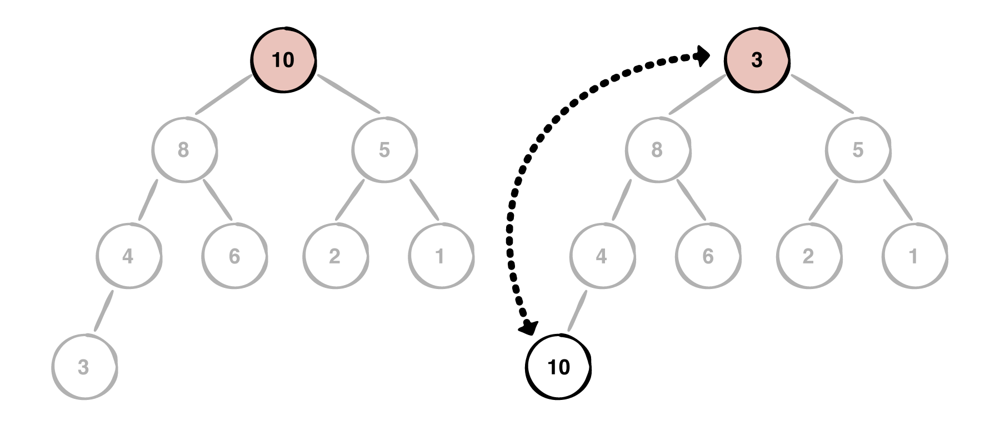

2. **定位下沉目标**

   新堆顶 `3` 破坏了堆属性，检查其左右子节点（`8` 和 `5`），锁定其中较大的子节点 `8`。

   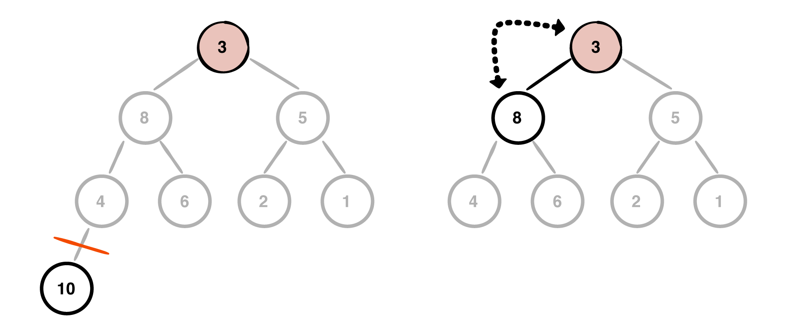

3. **第一次下沉**

   因 $8 > 3$，将 `3` 与 `8` 交换位置。`8` 升为新堆顶，`3` 下沉一层。

   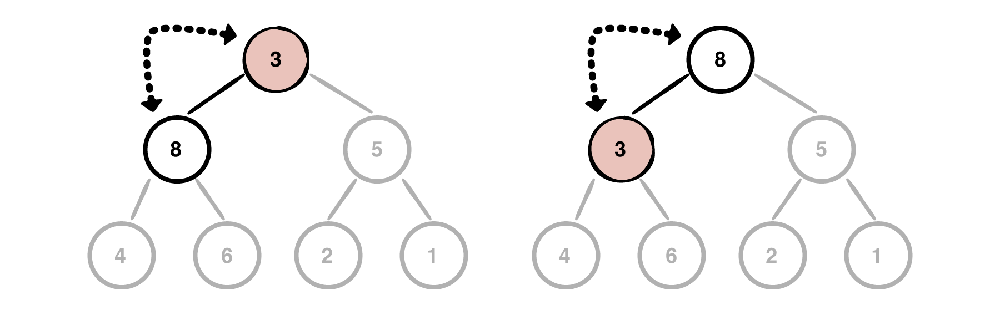

4. **再次定位目标**

   检查来到新位置的 `3` 的左右子节点（`4` 和 `6`），锁定其中较大的子节点 `6`。

   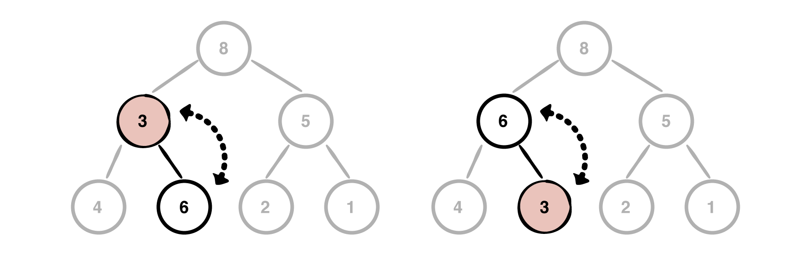

5. **第二次下沉（完成调整）**

   因 $6 > 3$，将 `3` 与 `6` 再次交换。此时 `3` 已到达叶子节点，向下调整结束，堆重新恢复平衡。

   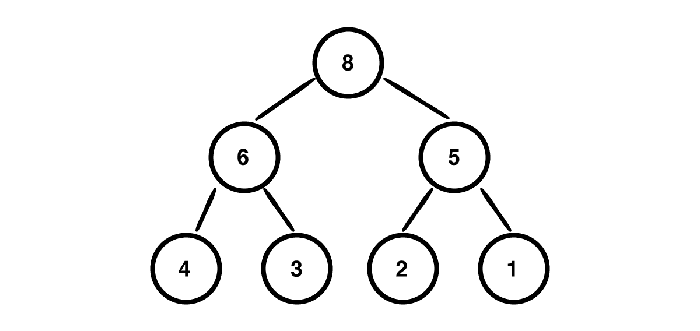

#### 删除堆顶的实现

```c++
// 向下调整：不断与较大的子节点比较并交换，直到满足大顶堆性质
void siftDown(int i) {
    int size = heap.size();

    // 当存在左子节点时继续调整（即当前节点不是叶子节点）
    while (2 * i + 1 < size) {
        int left = 2 * i + 1;      // 左子节点下标
        int right = 2 * i + 2;     // 右子节点下标
        int largest = i;          // 暂定当前节点为最大者

        // 找出 当前节点、左子节点、右子节点 中的最大值下标
        if (heap[left] > heap[largest]) {
            largest = left;
        }
        if (right < size && heap[right] > heap[largest]) {
            largest = right;
        }

        // 若最大者不是当前节点，说明破坏了堆属性，需要向下交换
        if (largest != i) {
            std::swap(heap[i], heap[largest]);
            i = largest; // 跟踪节点下沉到子节点位置，继续向下比较
        } else {
            break; // 已经满足堆属性，提前终止
        }
    }
}

// 删除堆顶接口
void pop() {
    if (heap.empty()) return;

    heap[0] = heap.back(); // 1. 用末尾元素覆盖堆顶（原堆顶被替换/删除）
    heap.pop_back();       // 2. 移除数组末尾节点

    if (!heap.empty()) {
        siftDown(0);       // 3. 对新的堆顶执行向下调整
    }
}
```

### 删除任意位置元素

从堆的任意位置删除元素时，通用做法是：**用数组末尾的元素覆盖待删除位置的元素，然后移除末尾节点**。

由于替换上来的末尾元素大小不确定，可能破坏堆属性，因此需要进行双向调整（`Sift-Up` 或 `Sift-Down`）：

#### 情况一：替换后的元素大于父节点

如下图所示，假设我们要删除值为 `5` 的节点：

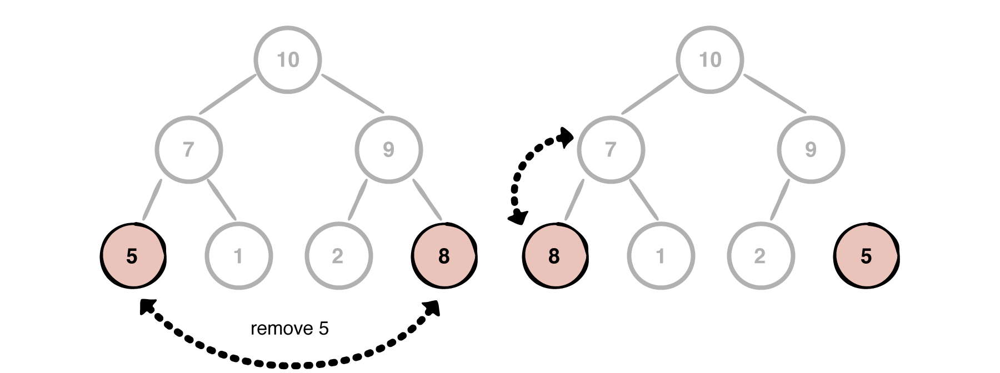

1. **覆盖与切除**：将末尾节点 `8` 移动到待删除节点 `5` 的位置，并切除原末尾节点 `5`。
2. **向上比较**：检查新位置上的 `8` 与其父节点 `7` 的大小。
3. **向上调整**：因 $8 > 7$，打破大顶堆属性，将 `8` 与 `7` 交换位置（Sift-Up）。

#### 情况二：替换后的元素小于子节点

如下图所示，假设我们要删除值为 `7` 的节点：

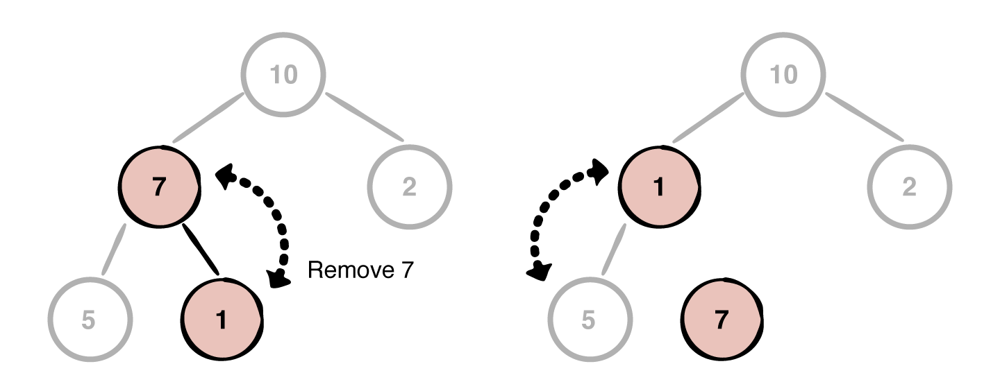

1. **覆盖与切除**：将末尾节点 `1` 移动到待删除节点 `7` 的位置，并切除原末尾节点 `7`。
2. **定位子节点**：检查新位置上的 `1` 的子节点（只有左子节点 `5`）。
3. **向下调整**：因 $5 > 1$，打破大顶堆属性，将 `1` 与 `5` 交换位置（Sift-Down），`1` 下沉为叶子节点。

#### 删除任意位置的实现

```c++
// 删除指定下标 index 处的元素
void removeAt(int index) {
    if (index < 0 || index >= heap.size()) return;

    // 1. 如果刚好是最后一个元素，直接弹出
    if (index == heap.size() - 1) {
        heap.pop_back();
        return;
    }

    // 2. 用末尾元素覆盖当前位置，并移除末尾元素
    heap[index] = heap.back();
    heap.pop_back();

    // 3. 尝试向下或向上调整（只会触发其中一种）
    siftDown(index);
    siftUp(index);
}
```

## 堆的主要应用场景

1. **优先队列（Priority Queue）**
   - 普通队列遵循“先进先出”，而优先队列每次出队的是“优先级最高”的元素。C++ 的 `std::priority_queue` 和 Java 的 `PriorityQueue` 底层都是基于堆实现的。
2. **堆排序（Heap Sort）**
   - 一种原地的、不稳定排序算法，时间复杂度在最好、最坏、平均情况下均为 $\mathcal{O}(n \log n)$。
3. **海量数据 Top-K 问题**
   - 例如：在 10 亿个整数中找出最大的前 100 个数。
   - **解法**：维护一个大小为 $K=100$ 的 **小顶堆**，遍历数据并与堆顶比较，最终堆内留下的就是最大的 100 个数。空间复杂度仅需 $\mathcal{O}(K)$。
4. **合并 $K$ 个有序链表 / 流数据合并**
   - 利用小顶堆维护每个链表的当前头节点，每次取出最小值，时间复杂度为 $\mathcal{O}(N \log K)$。
