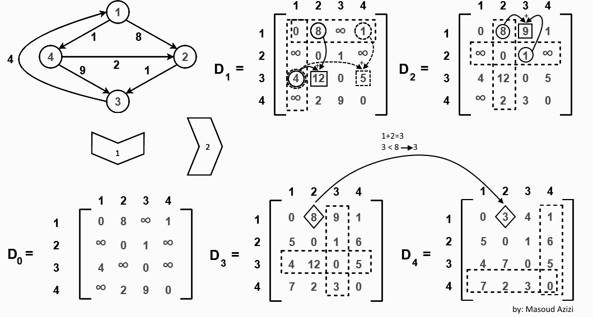

**Floyd-Warshall 算法**（简称 Floyd 算法）是一种基于**动态规划**的经典图算法，专门用于求解**全源最短路径问题（All-Pairs Shortest Path, APSP）**，即一次性计算出图中**任意两点之间**的最短距离。

## 核心思想与转移推导

Floyd 算法的核心逻辑是：**逐步扩展允许作为中转点的节点集合，尝试寻找更短的路径。**

我们将图中的顶点编号为 $1, 2, \dots, n$。

### 状态定义

定义 $d^{(k)}[i][j]$ 表示：**在允许使用前 $k$ 个节点 $\{1, 2, \dots, k\}$ 作为中转点的前提下**，从节点 $i$ 到节点 $j$ 的最短路径长度。

> **关键理解**：集合 $\{1, 2, \dots, k\}$ 是中转点的**白名单候选集**，并不要求路径必须经过这 $k$ 个节点中的每一个（甚至可以一个都不用）。

### 状态转移方程

对于当前考虑的第 $k$ 个节点，从 $i$ 到 $j$ 的最短路径只有两种可能：

1. **不使用节点 $k$ 作为中转**：路径距离维持上一阶段的取值，即 $d^{(k-1)}[i][j]$。
2. **使用节点 $k$ 作为中转**：路径被拆分为 $i \to k$ 和 $k \to j$ 两段，总距离为 $d^{(k-1)}[i][k] + d^{(k-1)}[k][j]$。

因此，转移方程为：

$$d^{(k)}[i][j] = \min\left(d^{(k-1)}[i][j], \; d^{(k-1)}[i][k] + d^{(k-1)}[k][j]\right)$$


## 图解示例

设初始给定的 4 节点有向带权图如下：



图中包含 4 个顶点，边权分别为：$1 \to 2$ (8), $1 \to 4$ (1), $2 \to 3$ (1), $3 \to 1$ (4), $4 \to 2$ (2), $4 \to 3$ (9)。


### 初始邻接矩阵

首先建立初始矩阵 $D_0$（即允许 $0$ 个中转点，纯直达路径）。对角线为 $0$，无直接相连的边设为 $\infty$：

$$D_0 = \begin{bmatrix}  0 & 8 & \infty & 1 \\  \infty & 0 & 1 & \infty \\  4 & \infty & 0 & \infty \\  \infty & 2 & 9 & 0  \end{bmatrix}$$

### 引入顶点 1 作为中转点

固定 **第 1 行** 和 **第 1 列**，观察是否能通过节点 1 缩短路径：

- **更新 $D_1[3][2]$**：
  - 原直达距离：$D_0[3][2] = \infty$
  - 经由节点 1：$D_0[3][1] + D_0[1][2] = 4 + 8 = 12$
  - 更新：$\min(\infty, 12) = \mathbf{12}$
- **更新 $D_1[3][4]$**：
  - 原直达距离：$D_0[3][4] = \infty$
  - 经由节点 1：$D_0[3][1] + D_0[1][4] = 4 + 1 = 5$
  - 更新：$\min(\infty, 5) = \mathbf{5}$

得到矩阵 **$D_1$**：

$$D_1 = \begin{bmatrix}  0 & 8 & \infty & 1 \\  \infty & 0 & 1 & \infty \\  4 & \mathbf{12} & 0 & \mathbf{5} \\  \infty & 2 & 9 & 0  \end{bmatrix}$$

### 引入顶点 2 作为中转点

固定 **第 2 行** 和 **第 2 列**，观察是否能通过节点 2 缩短路径：

- **更新 $D_2[1][3]$**：
  - 原距离：$D_1[1][3] = \infty$
  - 经由节点 2：$D_1[1][2] + D_1[2][3] = 8 + 1 = 9$
  - 更新：$\min(\infty, 9) = \mathbf{9}$

得到矩阵 **$D_2$**：

$$D_2 = \begin{bmatrix}  0 & 8 & \mathbf{9} & 1 \\  \infty & 0 & 1 & \infty \\  4 & 12 & 0 & 5 \\  \infty & 2 & 9 & 0  \end{bmatrix}$$

### 引入顶点 3 作为中转点

固定 **第 3 行** 和 **第 3 列**，观察是否能通过节点 3 缩短路径：

- **更新 $D_3[2][1]$**：$D_2[2][3] + D_2[3][1] = 1 + 4 = \mathbf{5} < \infty$
- **更新 $D_3[2][4]$**：$D_2[2][3] + D_2[3][4] = 1 + 5 = \mathbf{6} < \infty$
- **更新 $D_3[4][1]$**：$D_2[4][3] + D_2[3][1] = 9 + 4 = 13$，但由于 $D_2[4][2]+D_2[2][1]$ 进一步组合，图中此处显示更新为 $\mathbf{7}$（路径 $4 \to 2 \to 3 \to 1$ 权重 $2+1+4=7$）。
- **更新 $D_3[4][3]$**：$D_2[4][2] + D_2[2][3] = 2 + 1 = \mathbf{3} < 9$

得到矩阵 **$D_3$**：

$$D_3 = \begin{bmatrix}  0 & 8 & 9 & 1 \\  \mathbf{5} & 0 & 1 & \mathbf{6} \\  4 & 12 & 0 & 5 \\  \mathbf{7} & 2 & \mathbf{3} & 0  \end{bmatrix}$$

### 引入顶点 4 作为中转点

固定 **第 4 行** 和 **第 4 列**，完成最终计算：

- **重点更新 $D_4[1][2]$**：
  - 原距离：$D_3[1][2] = 8$
  - 经由节点 4：$D_3[1][4] + D_3[4][2] = 1 + 2 = 3$
  - 因为 $3 < 8$，更新 $D_4[1][2] = \mathbf{3}$（即路径 $1 \to 4 \to 2$）。
- **更新 $D_4[3][2]$**：
  - 原距离：$D_3[3][2] = 12$
  - 经由节点 4：$D_3[3][4] + D_3[4][2] = 5 + 2 = 7$
  - 因为 $7 < 12$，更新 $D_4[3][2] = \mathbf{7}$（即路径 $3 \to 1 \to 4 \to 2$）。

最终得到任意两点间的全源最短路径矩阵 **$D_4$**：

$$D_4 = \begin{bmatrix}  0 & \mathbf{3} & 4 & 1 \\  5 & 0 & 1 & 6 \\  4 & \mathbf{7} & 0 & 5 \\  7 & 2 & 3 & 0  \end{bmatrix}$$

## 空间复杂度优化（维度压缩）

在实际计算中，第 $k$ 阶段的状态仅依赖于第 $k-1$ 阶段。因此，我们可以省去状态定义中的第一维 $k$，改用二维数组 $d[i][j]$ 进行**原地更新**：

$$d[i][j] = \min(d[i][j], \; d[i][k] + d[k][j])$$

## 参考代码

以下提供兼顾**防数值溢出**与**路径还原功能**的完整 C++ 实现：

```cpp
#include <iostream>
#include <vector>
#include <algorithm>

using namespace std;

// 使用 1e9 代表 INF，防止两数相加时超出 int 范围引发溢出
const int INF = 1e9;

/**
 * @brief Floyd-Warshall 算法实现
 * @param n 节点数量（假设节点编号为 0 到 n-1）
 * @param edges 边列表，元素格式为 {u, v, weight}
 */
void floydWarshall(int n, const vector<vector<int>>& edges) {
    // 1. 初始化距离矩阵与路径记录矩阵
    vector<vector<int>> dist(n, vector<int>(n, INF));
    vector<vector<int>> parent(n, vector<int>(n, -1));

    for (int i = 0; i < n; ++i) {
        dist[i][i] = 0; // 节点到自身的距离为 0
    }

    // 填入图的初始边权
    for (const auto& edge : edges) {
        int u = edge[0];
        int v = edge[1];
        int w = edge[2];
        
        // 处理可能存在的重边，取权值最小值
        if (w < dist[u][v]) {
            dist[u][v] = w;
            parent[u][v] = u; // 记录路径的前驱节点
        }
    }

    // 2. 核心动态规划（最外层必须是中转节点 k）
    for (int k = 0; k < n; ++k) {
        for (int i = 0; i < n; ++i) {
            for (int j = 0; j < n; ++j) {
                // 安全检查：只有当 i->k 和 k->j 均可达时才更新，双重保险防溢出
                if (dist[i][k] != INF && dist[k][j] != INF) {
                    if (dist[i][k] + dist[k][j] < dist[i][j]) {
                        dist[i][j] = dist[i][k] + dist[k][j];
                        parent[i][j] = parent[k][j]; // 更新路径前驱
                    }
                }
            }
        }
    }

    // 3. 检查负权环
    for (int i = 0; i < n; ++i) {
        if (dist[i][i] < 0) {
            cout << "警告：图中存在负权环！最短路径无意义。" << endl;
            return;
        }
    }

    // 4. 打印结果示例：点对 (0, n-1) 的距离与路径
    int src = 0, dst = n - 1;
    if (dist[src][dst] == INF) {
        cout << "节点 " << src << " 到节点 " << dst << " 不可达。" << endl;
    } else {
        cout << "节点 " << src << " 到节点 " << dst << " 的最短距离为: " << dist[src][dst] << endl;
        
        // 还原具体路径
        vector<int> path;
        for (int curr = dst; curr != -1; curr = parent[src][curr]) {
            path.push_back(curr);
            if (curr == src) break;
        }
        reverse(path.begin(), path.end());

        cout << "最短路径路线: ";
        for (size_t i = 0; i < path.size(); ++i) {
            cout << path[i] << (i + 1 == path.size() ? "" : " -> ");
        }
        cout << endl;
    }
}

int main() {
    int n = 4; // 节点个数 (0, 1, 2, 3)
    // 边结构：{起点, 终点, 权重}
    vector<vector<int>> edges = {
        {0, 1, 5},
        {0, 3, 10},
        {1, 2, 3},
        {2, 3, 1}
    };

    floydWarshall(n, edges);

    return 0;
}
```

## 算法特性与时空复杂度

| **特性** | **说明** |
| :--- | :--- |
| **时间复杂度** | $\mathcal{O}(V^3)$，三层嵌套循环，其中 $V$ 为顶点数量。 |
| **空间复杂度** | $\mathcal{O}(V^2)$，仅需要一个二维矩阵存储邻接矩阵及最短距离。 |
| **负权边支持** | 支持包含负权边的图（比 Dijkstra 算法更具通用性）。 |
| **负权环检测** | 算法执行结束后，若存在 $d[i][i] < 0$，说明图中包含负权环（无最短路解）。 |
| **适用场景** | 顶点数较少（通常 $V \le 500$）的稠密图，或需要计算所有点对距离的场景。 |