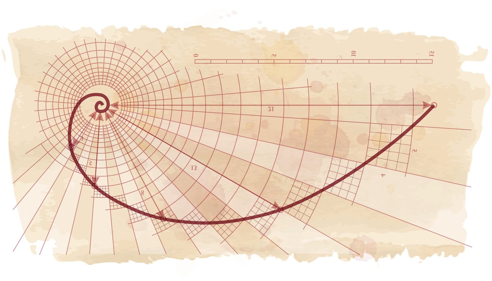

简单来说，递归（Recursion）就是 **“函数在定义或执行过程中直接或间接调用自己”** 的一种编程与解决问题的技巧。

用生活中的比喻，递归就像**拆俄罗斯套娃**或在电影院里问自己的排数：

> 你想知道自己坐在第几排，但后面看不清。于是你问前排的人：“你是第几排？”前排的人也不清楚，于是他也问他的前排……直到第一排的人回答：“我是第1排！”这个消息再一层层传回来，你最终得知了自己的排数（前排的排数 + 1）。

## 递归的两大核心要素

任何正确的递归都必须具备两个条件，缺一不可：

1. **终止条件（Base Case）：** 最小的、可以直接得出结果的已知情况（即“边界”）。如果没有终止条件，程序就会无限循环调用，最终导致**栈溢出（Stack Overflow）**。
2. **递归步骤（Recursive Step）：** 将大问题拆解为结构相同、但规模更小的子问题，并调用自身。

## 递归通用代码模板

写递归代码时，最忌讳“用大脑模拟复杂的调用栈”。只要掌握通用模板，按照逻辑填空即可：

```c++
ReturnType recursiveFunction(Parameters params) {
    // 1. 终止条件 (Base Case)：防死循环、触底返回
    if (isBaseCase(params)) {
        return baseResult;
    }
    
    // 2. 本层逻辑 (Current Level Logic)：处理当前层需要的计算或状态变化
    // ...
    
    // 3. 递归调用 (Recursive Step)：下探到下一层（注意：必须缩小问题规模）
    ReturnType subResult = recursiveFunction(smallerParams);
    
    // 4. 结果合并/清理 (Combine & Cleanup)：利用子问题结果构造当前层结果
    return processResult(subResult);
}
```

## 经典数学模型与实现

### 单分支递归 —— 阶乘计算

阶乘计算是单线性递归的典型代表。计算 $n!$ 的数学定义为：

$$n! = \begin{cases} 1 & \text{if } n \le 1 \\ n \times (n-1)! & \text{if } n > 1 \end{cases}$$

在 C++ 中，单分支递归代码如下：

```c++
#include <iostream>

// 递归函数：计算 n 的阶乘
long long factorial(int n) {
    // 1. 终止条件 (Base Case)
    if (n <= 1) {
        return 1;
    }
    // 2. 递归步骤 (Recursive Step)
    return n * factorial(n - 1);
}

int main() {
    int n = 5;
    
    if (n < 0) {
        std::cout << "负数没有阶乘！" << std::endl;
    } else {
        std::cout << n << " 的阶乘是: " << factorial(n) << std::endl;
    }

    return 0;
}
```

**执行流程分为两个阶段：**

- **递推（Push 到调用栈）：** `factorial(4)` $\rightarrow$ `4 * factorial(3)` $\rightarrow$ `3 * factorial(2)` $\rightarrow$ `2 * factorial(1)`
- **回归（Pop 出调用栈）：** 到达终止条件 `factorial(1) = 1` 后开始反弹触底，依次返回 `1` $\rightarrow$ `2` $\rightarrow$ `6` $\rightarrow$ `24`。

### 多分支递归 —— 斐波那契数列



斐波那契数列是多分支（双重递归）的典型代表。它的规则是从第 3 项开始，每一项都等于前两项之和：`0, 1, 1, 2, 3, 5, 8, 13, 21, 34, ...`

数学定义如下：

$$F(n) = \begin{cases} 0 & \text{if } n = 0 \\ 1 & \text{if } n = 1 \\ F(n-1) + F(n-2) & \text{if } n > 1 \end{cases}$$

在 C++ 中，多分支递归代码如下：

```c++
#include <iostream>

// 基础递归求解第 n 项斐波那契数
long long fibonacci(int n) {
    // 1. 终止条件
    if (n <= 0) return 0;
    if (n == 1) return 1;
    
    // 2. 递归步骤：拆解为两个更小的子问题并求和
    return fibonacci(n - 1) + fibonacci(n - 2);
}
```

## 递归的进阶陷阱：重叠子问题与优化

虽然斐波那契数列的递归写法极具数学美感且代码简洁，但它揭示了递归的一个重大陷阱：**重复计算导致的指数级时间复杂度**。

以计算 `fibonacci(5)` 为例，其递归调用树如下：

```tex
                  fib(5)
               /          \
           fib(4)        fib(3)
          /      \       /     \
      fib(3)   fib(2)  fib(2)  fib(1)
     /     \
  fib(2)  fib(1)
```

可以看到，`fib(3)` 被重复计算了 2 次，`fib(2)` 被重复计算了 3 次！这使得朴素递归的时间复杂度高达 $O(2^n)$。

**常见优化思路：**

1. **记忆化搜索（Memoization）：** 在递归过程中使用哈希表或数组记录已经计算过的结果，下次直接读取，将时间复杂度降至 $O(n)$。
2. **动态规划（Dynamic Programming）：** 摒弃自顶向下的递归，改为“自底向上”从 0 和 1 递推累加，可进一步将空间复杂度优化至 $O(1)$。